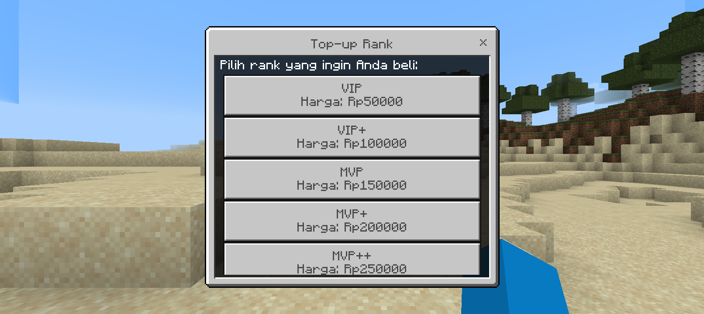
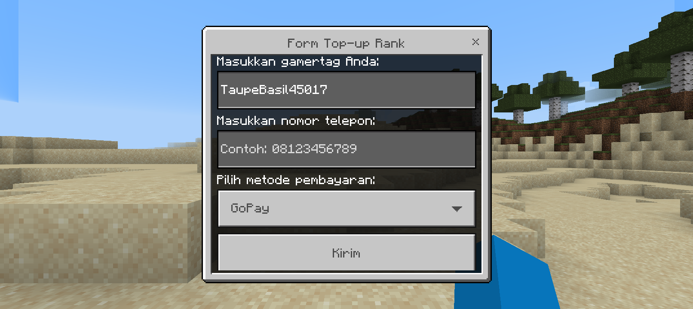
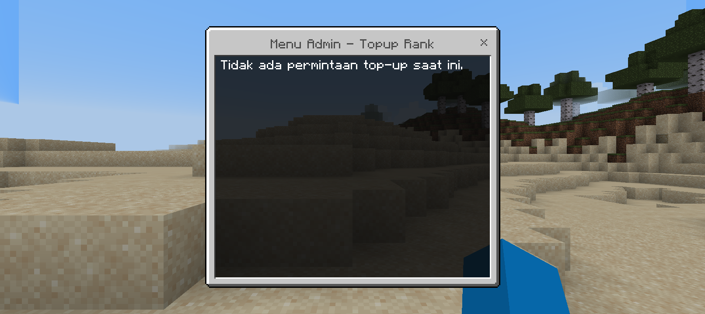
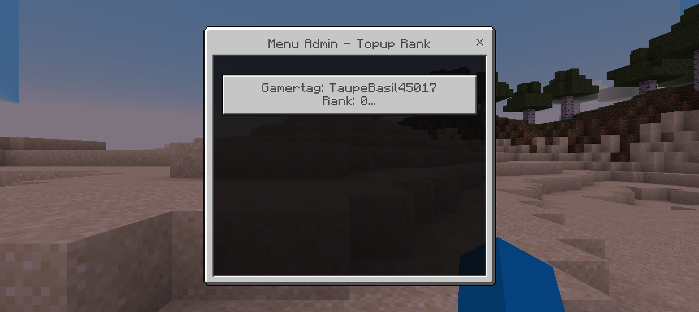
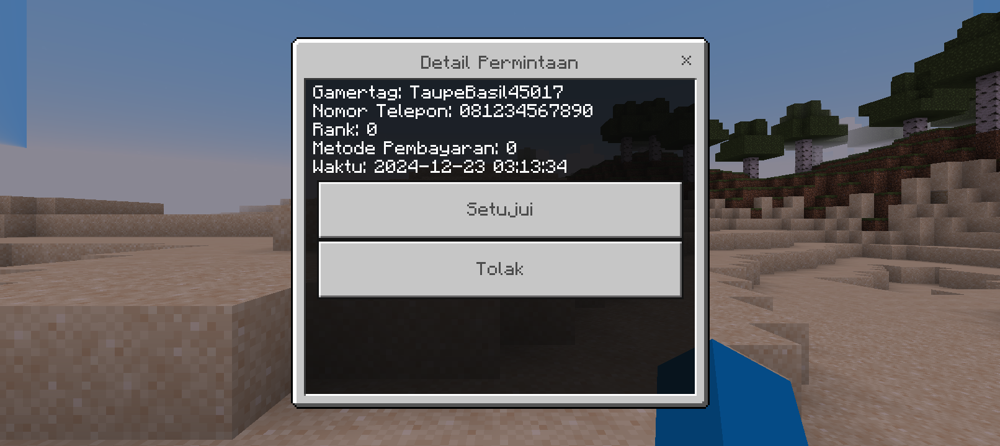

## About
~FGRankShop~ -> TopupRank
- Plugin ini adalah reinkarnasi dari FGRankShop yang sempruna **TopupRank**
- Plugin Ini Masih Dalam Tahap Pengembangan Jika Ada Bug Atau Eror Bisa Open Issue Atau Discord
- [Download Link](https://github.com/VsrStudio/TopupRank/archive/refs/heads/main.zip)
# Dependencies
- [TopupRankAPI](https://github.com/VsrStudio/TopupRankAPI)
- [RankSystem](https://github.com/IvanCraft623/RankSystem)
- [FormAPI](https://github.com/jojoe77777/FormAPI)
## Warning
```yaml
Name: TopupRank
Author: VsrStudio
Version: 1.0.1-BETA
```
Jangan menghapus atau mengganti salah satu code di atas jika di hapus sever akan tershotdown

## Config
- Data Permintaan/Order Tersimpan Di plugin_data -> topuprank -> order.json & order_log.txt
- Contoh api_keys.yml
```yaml
api_key: "abcd1234efgh5678ijkl9012mnop3456"
```
- Open Config.yml
```yaml
ranks:
  VIP: 50000
  VIP+: 100000
  MVP: 150000
  MVP+: 200000
  MVP++: 250000

payment_methods:
  - Paypal
  - DANA
  - OVO
```

## Command
- /topuprank Open the top up rank menu
- /rankadmin Open the form admin

## Screenshot





